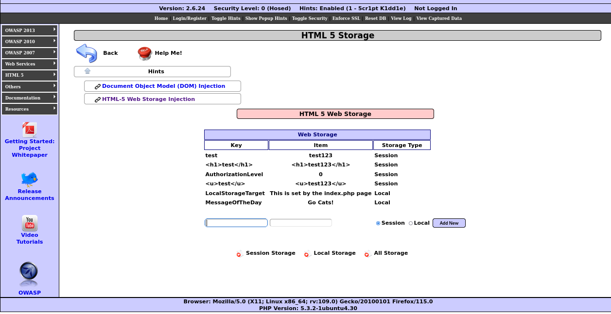
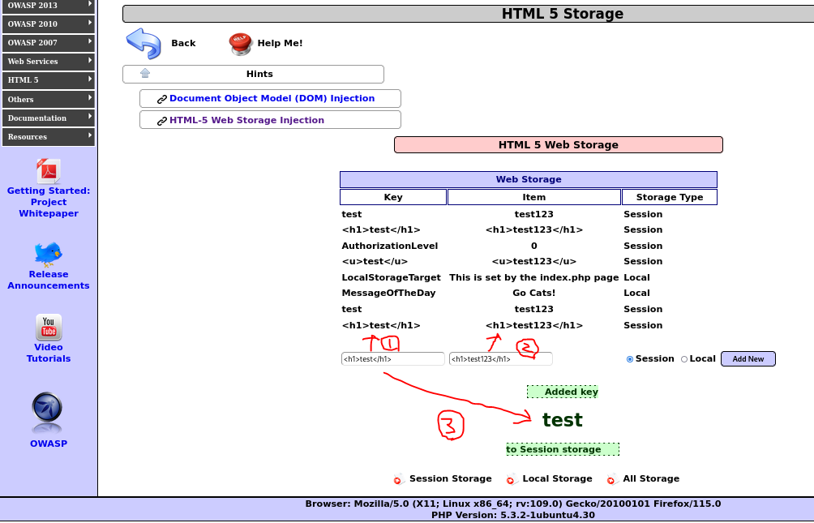
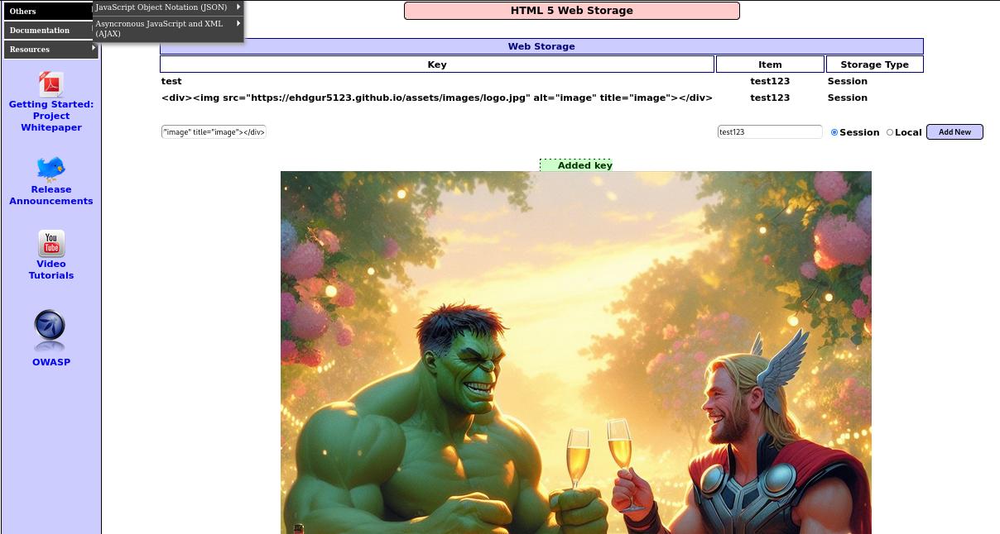

<hr>

# HTML Injection이란 무엇인가?

## 개요

**HTML Injection**은 웹 애플리케이션의 보안 취약점 중 하나로, 공격자가 악의적인 **HTML 코드**를 웹 페이지에 **삽입**할 수 있도록 하는 문제입니다. 이 취약점은 주로 사용자 입력을 제대로 검증하지 않을 때 발생하며, 공격자는 이를 통해 페이지의 외형을 변경하거나, 스크립트를 실행시켜 사용자의 브라우저에서 민감한 정보를 탈취하는 등의 공격을 수행할 수 있습니다.

## HTML Injection의 기본 원리

HTML Injection은 주로 웹 사이트가 사용자로부터 받은 입력을 HTML 페이지에 포함할 때, 해당 입력을 적절히 처리하지 않는 경우 발생합니다. 예를 들어, 웹 사이트에서 댓글이나 리뷰를 작성할 수 있는 기능이 있을 때, 사용자가 HTML 코드를 입력하고 그 코드가 그대로 페이지에 출력되면 HTML Injection이 발생합니다.

공격자는 다음과 같은 코드를 삽입할 수 있습니다.

```html
<script>alert('이 사이트는 취약합니다!');</script>
```

이 코드는 웹 페이지가 렌더링될 때 실행되어 사용자에게 알림을 띄우거나, 심지어 더 악의적인 코드로 브라우저에서 데이터를 탈취할 수도 있습니다.

## HTML Injection의 유형

HTML Injection은 크게 두 가지로 나뉩니다.

1. <b>Stored HTML Injection(저장형 HTML Injection)</b>: 공격자가 삽입한 악성 HTML 코드가 데이터베이스에 저장되어, 해당 콘텐츠를 보는 모든 사용자에게 영향을 미치는 경우입니다. 댓글 시스템이나 사용자 프로필 페이지 등에서 자주 발생합니다.

2. <b>Reflected HTML Injection(반사형 HTML Injection)</b>: 공격자가 삽입한 악성 HTML 코드가 즉시 웹 서버의 응답에 포함되어 실행되는 경우입니다. 주로 URL에 파라미터로 포함된 악성 코드가 서버의 응답 페이지에 반영될 때 발생합니다.

## HTML Injection의 위험성

HTML Injection이 발생하면 여러 가지 심각한 문제가 발생할 수 있습니다.

- <b>웹 페이지 변조</b>: 공격자가 웹 페이지의 구조를 변경하여, 외관을 조작하거나 허위 정보를 노출할 수 있습니다.
- <b>피싱 공격</b>: 가짜 로그인 폼을 삽입하여 사용자의 로그인 정보를 탈취하는 데 악용될 수 있습니다.
- <b>세션 탈취</b>: 쿠키 정보를 훔치거나 악성 스크립트를 통해 사용자의 세션을 탈취하여, 인증된 사용자로 가장할 수 있습니다.
- <b>브라우저 악성코드 실행</b>: JavaScript와 같은 스크립트를 실행시켜 사용자의 브라우저에서 원격 코드 실행 등의 악성 행위를 수행할 수 있습니다.

## HTML Injection과 XSS (Cross-Site Scripting)의 차이

HTML Injection과 XSS는 유사한 점이 많아 종종 혼동되지만, 미묘한 차이가 있습니다. **XSS**는 보통 **JavaScript** 코드 실행을 목표로 하지만, HTML Injection은 단순히 HTML 코드가 삽입되어 페이지 구조를 변경하는 것에 중점을 둡니다. XSS 공격의 일부로 HTML Injection이 포함될 수 있지만, HTML Injection 자체는 스크립트 실행뿐만 아니라 페이지 외형 변경, 콘텐츠 주입 등을 포함합니다.

## HTML Injection의 방어 방법

- <b>입력 검증 및 필터링</b>: 사용자로부터 입력받는 모든 데이터는 엄격하게 검증되어야 합니다. 특정 HTML 태그나 속성을 필터링하거나, 아예 HTML 태그 자체를 금지하는 것이 좋습니다.

- <b>출력 인코딩</b>: 사용자 입력을 HTML 콘텐츠로 출력할 때는 반드시 이를 적절히 인코딩해야 합니다. 예를 들어, `<`는 `&lt;`, `>`는 `&gt;`로 인코딩되어야 합니다. 이를 통해 브라우저가 태그로 해석하지 않게 만들 수 있습니다.

- <b>보안 프레임워크 사용</b>: 일부 보안 프레임워크는 HTML Injection을 방지하는 기능을 내장하고 있습니다. 예를 들어, Java의 Spring Security나 PHP의 HTML Purifier는 HTML Injection 공격을 방어하는 데 유용한 도구입니다.

- <b>CSP(Content Security Policy) 설정</b>: 웹 사이트의 CSP 헤더를 설정하여, 악성 스크립트가 실행되지 않도록 할 수 있습니다. CSP는 페이지에서 실행될 수 있는 리소스의 출처를 제한함으로써, 공격자가 삽입한 스크립트의 실행을 차단합니다.

## 결론

HTML Injection은 간과하기 쉬운 취약점이지만, 제대로 방어하지 않을 경우 큰 피해를 초래할 수 있습니다. 웹 애플리케이션을 개발할 때는 사용자 입력을 철저히 검증하고 적절히 처리하는 것이 중요합니다. 철저한 보안 관리를 통해 HTML Injection을 예방하고 안전한 웹 환경을 유지할 수 있습니다.

# HTML Injection 예제

간단한 예제를 위해 **OWASP BWA**의 HTML 취약점이 있는 사이트에 접속하겠습니다.

실습 URL: `http://192.168.111.129/mutillidae/index.php?page=html5-storage.php`

<p id="img_center">
  
</p>

두 개의 입력창에 각각 `test`와 `test123`을 입력한 뒤 `Add New` 버튼을 누르면 아래와 같은 화면이 나타 납니다.

<p id="img_center">
  
</p>

세 군데에 사용자로부터 받은 입력을 웹 사이트가 HTML 페이지에 포함하고 있습니다.

이제 각 입력창에 `<h1>`이라는 HTML 태그를 삽입하겠습니다.(예: `<h1>test</h1>`)

<p id="img_center">
  
</p>

`1번`과 `2번`은 HTML 태그를 문자로 인식하지만, `3번`은 `<h1>` 태그가 적용되어 출력되었습니다. 

`3번`과 같은 유형이 **HTML Injection의 취약점**입니다.

공격자는 이를 통해 페이지의 외형을 변경하거나, 스크립트(`<script>`)를 실행시켜 사용자의 브라우저에서 민감한 정보를 탈취하는 등의 공격을 수행할 수 있습니다.

<p id="img_center">
  
</p>