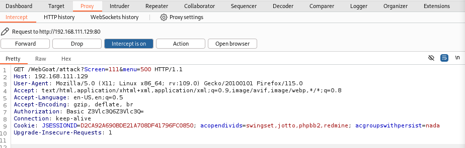

<hr>

# Broken Authentication이란 무엇인가?

## 개요

**Broken Authentication**은 웹 애플리케이션의 **인증 및 세션 관리** 기능에서 발생하는 **취약점**으로, 사용자 인증이 제대로 작동하지 않아 <u>공격자가 다른 사용자로 가장할 수 있게 만드는 보안 문제</u>입니다. 이 취약점은 웹 애플리케이션이 사용자의 자격 증명을 보호하지 못하거나, 세션 관리가 부적절하게 이루어질 때 발생하며, 인증 시스템을 우회하여 민감한 정보에 접근하거나 계정을 탈취할 수 있습니다.

**OWASP(오픈 웹 애플리케이션 보안 프로젝트)**에 따르면, Broken Authentication은 웹 애플리케이션에서 발생하는 주요 보안 취약점 중 하나입니다. 이는 공격자가 임의로 다른 사용자 계정을 제어하거나 중요 데이터에 접근할 수 있게 만들기 때문에 심각한 보안 사고로 이어질 수 있습니다.

## Broken Authentication의 원인

Broken Authentication은 주로 아래와 같은 이유로 발생합니다

1. <b>약한 비밀번호 정책</b>: 사용자가 너무 짧거나 예측 가능한 비밀번호를 설정하도록 허용할 때, 공격자는 이를 쉽게 추측하거나 사전 공격(Dictionary Attack)을 통해 접근할 수 있습니다.

1. <b>자격 증명 전송 보호 미흡</b>: HTTPS 대신 HTTP로 로그인 자격 증명(아이디, 비밀번호 등)이 전송될 경우, 네트워크 상에서 이 정보가 가로채질 수 있습니다. 이로 인해 공격자는 **중간자 공격**(Man-in-the-Middle Attack)을 통해 데이터를 탈취할 수 있습니다.

1. <b>세션 관리 취약점</b>: **세션 토큰**이 유출되거나 재사용될 수 있거나, 세션 만료 시간이 너무 길면 공격자가 이를 이용해 인증된 사용자로 가장할 수 있습니다. 이는 **세션 고정**(Session Fixation) 또는 **세션 하이재킹**(Session Hijacking)과 같은 공격으로 이어질 수 있습니다.

1. <b>브루트포스 공격 방지 미흡</b>: 계정 잠금 정책이 부재하거나 비밀번호 시도 횟수에 제한이 없을 경우, 공격자는 다양한 비밀번호 조합을 시도하는 **브루트포스 공격(Brute Force Attack)**을 통해 계정을 탈취할 수 있습니다.

1. <b>비밀번호 재설정 메커니즘의 취약점</b>: 비밀번호 재설정 기능에서 질문과 답변이 예측 가능하거나, 재설정 링크가 쉽게 조작될 수 있다면 공격자는 이를 악용하여 사용자의 비밀번호를 변경할 수 있습니다.

## Broken Authentication의 주요 공격 유형

1. **크리덴셜 스터핑**(Credential Stuffing): 사용자들이 여러 웹사이트에서 동일한 비밀번호를 사용하는 경우, 공격자는 유출된 자격 증명(아이디와 비밀번호)을 여러 웹사이트에서 자동화된 도구로 시도하여 로그인할 수 있습니다. 이는 데이터 유출 사건에서 특히 자주 발생합니다.

1. **브루트포스 공격**(Brute Force Attack): 공격자가 여러 비밀번호 조합을 무차별적으로 시도하여 올바른 자격 증명을 찾는 방법입니다. 비밀번호 길이와 복잡도가 낮으면 이 공격에 매우 취약합니다.

1. **세션 하이재킹**(Session Hijacking): 공격자가 사용자의 세션 토큰을 탈취하여 해당 사용자의 세션에 접근하는 공격입니다. 공격자는 네트워크 상에서 세션 토큰을 가로채거나, 애플리케이션에서 세션 토큰이 노출되는 취약점을 이용할 수 있습니다.

1. **세션 고정**(Session Fixation): 공격자가 특정 세션 ID를 사용하도록 유도하여 사용자가 해당 세션에 로그인하면, 공격자가 동일한 세션 ID를 통해 해당 사용자로 가장할 수 있습니다.

## Broken Authentication의 위험성

Broken Authentication은 매우 심각한 보안 취약점으로, 공격자가 이를 악용하여 인증된 사용자로 가장할 수 있습니다. 그 결과, 다음과 같은 위험이 발생할 수 있습니다

- <b>계정 탈취</b>: 공격자는 사용자의 계정에 로그인하여 민감한 데이터를 열람하거나, 피해자 대신 계정을 악용할 수 있습니다.

- <b>개인 정보 유출</b>: 공격자가 다른 사용자의 계정에 접근할 수 있다면, 개인 정보가 유출될 위험이 있습니다.

- <b>서비스 남용</b>: 공격자는 관리자의 권한을 가진 계정을 탈취하여 시스템 전체를 제어하거나, 서비스에 악성 코드를 심어 전체 사용자에게 영향을 미칠 수 있습니다.

## Broken Authentication의 방어 방법

1. <b>강력한 비밀번호 정책</b>: 비밀번호는 최소 8자 이상의 복잡한 조합(대문자, 소문자, 숫자, 특수문자)을 요구하고, 너무 간단한 비밀번호는 허용하지 않는 것이 좋습니다. 또한, 사용자가 동일한 비밀번호를 여러 사이트에서 재사용하지 않도록 경고하는 것도 중요합니다.

1. <b>이중 인증(2FA)</b>: 추가적인 보안 계층으로 이중 인증(2단계 인증)을 도입하면, 비밀번호가 유출되더라도 공격자가 추가 인증 없이 계정에 접근하기 어렵습니다.

1. <b>비밀번호 재사용 금지</b>: 사용자가 이전에 사용한 비밀번호를 재사용하지 못하도록 정책을 설정해야 합니다. 이를 통해 유출된 자격 증명을 사용하는 공격을 방지할 수 있습니다.

1. <b>세션 관리 강화</b>: 세션 토큰은 난수로 생성되며 추측이 불가능해야 합니다. 또한, 사용자가 로그아웃하거나 일정 시간 동안 활동이 없을 경우 세션이 자동으로 만료되도록 설정하는 것이 중요합니다.

1. <b>계정 잠금 및 알림 기능</b>: 비밀번호를 여러 번 잘못 입력했을 때 계정을 잠그는 기능을 통해 브루트포스 공격을 방지할 수 있습니다. 또한, 비밀번호 변경이나 로그인 시도에 대한 알림을 사용자에게 제공하여 의심스러운 활동을 인지할 수 있게 해야 합니다.

1. <b>HTTPS 사용</b>: 모든 로그인과 인증 관련 통신은 HTTPS를 통해 암호화되어야 합니다. 이를 통해 네트워크 상에서 자격 증명이 가로채질 위험을 방지할 수 있습니다.

1. <b>비밀번호 재설정 프로세스 강화</b>: 비밀번호 재설정 링크는 일회용으로 사용해야 하며, 일정 시간 후에 만료되도록 설정해야 합니다. 또한, 이메일 또는 휴대폰 인증을 통한 추가적인 확인 절차가 필요합니다.

## 결론

Broken Authentication은 웹 애플리케이션에서 발생할 수 있는 치명적인 보안 취약점으로, 이를 방치할 경우 사용자의 계정이 공격자의 손에 넘어갈 수 있습니다. 강력한 인증 메커니즘을 구축하고, 이중 인증, 세션 관리 강화, 비밀번호 정책 개선 등의 방어 조치를 통해 Broken Authentication 문제를 예방할 수 있습니다.

# Broken Authentication 예제

## 1. 쿠키(Cookie)를 통한 Broken Authentication

쿠키(Cookie)를 통한 Broken Authentication은 웹 애플리케이션의 인증 절차에서 **쿠키를 적절히 관리하지 않아 발생하는 취약점**을 말합니다. 이를 악용하면 공격자가 다른 사용자의 세션을 탈취하거나, 인증된 사용자로 위장할 수 있습니다.

간단한 예제를 위해 **OWASP BWA**의 쿠키(Cookie)를 통한 Broken Authentication 취약점이 있는 사이트에 접속하겠습니다.

실습 URL: `http://192.168.111.129/mutillidae/index.php?page=privilege-escalation.php`

원활한 실습을 위해 해당 웹사이트에 접속하여 회원가입을 진행합니다.(ID: `test01`, PW: `test123`)

로그인을 하면 아래 그림과 같이 우측 상단에 `test01`이라는 아이디로 접속된 것을 확인할 수 있습니다.

<p id="img_center">
  
</p>

이제 `burpsuite`에 접속하여, **Intercept**를 **On**으로 변경 후 요청 정보를 확인해 보겠습니다.

Intercept를 On으로 하고, 웹페이지를 새로고침하면 `burpsuite`에 다음과 같은 정보가 출력됩니다.

<p id="img_center">
  
</p>

쿠키값이 출력되며, 쿠키의 내용에는 `username`과 `uid` 등이 포함된 것을 볼 수 있습니다.

이때, `burpsuite`에서 `uid=25;`를 `uid=1`로 변경한 후 `Forward` 버튼을 누른 후 웹페이지를 확인 해보면, 아이디가 `admin`이라는 계정으로 접속되었습니다.

<p id="img_center">
  
</p>

## 2. HTTP 기본 인증(Basic Authentication)

**Basic Authorization in HTTP Request**는 HTTP 프로토콜을 사용해 서버와 클라이언트 간에 인증 정보를 전달하는 가장 간단한 방식 중 하나입니다. 이 인증 방식은 HTTP 요청의 **Authorization** **헤더**에 사용자 인증 정보를 포함시켜 서버에 전송하는 방법으로 이루어집니다.

**인코딩 방식**: Basic Authorization에서는 사용자 이름과 비밀번호가 결합되어 **Base64** 인코딩 방식으로 인코딩됩니다. 예를 들어, `username:password`라는 인증 정보가 주어지면 이를 `username:password` 형식으로 합쳐 Base64로 인코딩합니다. 이 결과값은 서버가 이해할 수 있도록 HTTP 요청의 Authorization 헤더에 포함됩니다.

예를 들어, `username:password`가 Base64로 인코딩되면 `dXNlcm5hbWU6cGFzc3dvcmQ=`와 같은 문자열이 됩니다.

### HTTP 기본 인증 Broken Authentication

OWASP의 **OWASP WebGoat**에 접속합니다.(ID: `guest`, PW: `guest`)

Basic Authentication 실습을 위해 다음 URL을 입력합니다.(`http://192.168.111.129/WebGoat/attack?Screen=111&menu=500`)

<p id="img_center">
  
</p>

이제 `burpsuite`에 접속하여, **Intercept**를 **On**으로 변경한 후 웹사이트를 새로고침하면 다음과 같은 정보가 잡힙니다.

<p id="img_center">
  
</p>

여기서 7번 째 줄에 `Authorization: Basic Z3Vlc3Q6Z3Vlc3Q=`라는 단어가 **Base64**로 인코딩된 `username:password`의 인증정보 입니다.

`burpsuite`의 **Decoder**를 통해 Base64를 디코딩하면 우리가 접속한 `username:password`인 `guest:guest`를 얻을 수 있습니다.

<p id="img_center">
  
</p>

## 3. 비밀번호 재설정

비밀번호 재설정(**Forgot Password Challenge**)에서 발생할 수 있는 Broken Authentication 취약점은 비밀번호 재설정 기능이 제대로 보호되지 않아서, 공격자가 허술한 인증 절차를 악용하여 다른 사용자의 계정을 탈취하거나 접근할 수 있는 상황을 의미합니다. 이 취약점은 주로 비밀번호 재설정 과정에서 사용자 신원을 검증하는 절차가 약하거나 불충분할 때 발생합니다.

주요 Forgot Password Challenge의 Broken Authentication 취약점 발생 원인은 다음과 같습니다.

1. 취약한 보안 질문
2. 비밀번호 재설정 링크의 유효 기간 미설정
3. 재설정 링크의 예측 가능성
4. 재설정 코드나 링크의 누출
5. 재설정 완료 후 세션 종료 미흡

### 비밀번호 재설정 Broken Authentication

OWASP의 **OWASP WebGoat**에 접속합니다.(ID: `guest`, PW: `guest`)

Basic Authentication 실습을 위해 다음 URL을 입력합니다.(`http://192.168.111.129/WebGoat/attack?Screen=140&menu=500`)

<p id="img_center">
  
</p>

해당 웹페이지는 아이디를 입력해서 비밀번호를 찾는 페이지로, 입력창에 `test`를 입력하고 `Submit` 버튼을 누르면 "유효한 사용자 이름이 아닙니다.다시 시도하십시오."라는 문구가 출력됩니다. 즉, 해당 웹페이지 내에 유효한 아이디를 찾아야 할 것 입니다.

`burpsuite`의 Intercept On 상태에서 `test`를 다시 입력 후 제출을 하면 다음과 같은 정보가 잡힙니다.

<p id="img_center">
  
</p>

유효한 아이디를 찾기 위해서는 16번 째 줄의 `username`인 `test`를 **Intruder**(침입자)하여야 합니다. `test`를 드래그하여 `Ctrl + I` 또는 마우스 우클릭의 `Send to Intruder`를 눌러줍니다.

<p id="img_center">
  
</p>

**Intruder**를 통해 `test`라고 적힌 공간에 다양한 입력값을 삽입하여, 실제 유효한 아이디를 찾는 브루트포스 공격 입니다.

Intruder 탭의 Payloads에서 입력할 값을 셋팅할 수 있습니다.

`/usr/share/wordlists/metasploits` 워드리스트가 위치한 경로로, 패스워드 크래킹을 위한 단어 목록을 제공합니다. 해당 경로에서 `http_default_users.txt`을 `Load`한 후 공격을 진행하겠습니다.

<p id="img_center">
  
</p>

공격을 진행하면 아래와 같이 표시됩니다. 여기서 **Lenght**는 응답된 데이터의 크기인대, `admin`의 Lenght는 나머지와 다른 응답이 왔다는 것을 확인할 수 있습니다.

<p id="img_center">
  
</p>

`admin`을 우클릭하여 `Show response in browser`을 누르면 나타나는 링크를 웹브라우저에 띄어 봅시다.(인터셉트는 off로 변경해줍니다.)

<p id="img_center">
  
</p>

위의 이미지를 보면 "가장 좋아하는 색은 무엇입니까?"라는 비밀번호 복구 질문이 나타난 것을 볼 수 있습니다.

즉, 유효한 ID는 `admin`이며, "가장 좋아하는 색은 무엇입니까?"라는 질문은 답이 거의 정해져 있는 아주 **취약한 보안 질문**에 해당됩니다.

아이디를 찾았던 것과 마찬가지로, 색깔을 Intruder하면 아래와 같이 비밀번호를 알아 낼 수 있습니다.(좋아하는 색깔의 답은 green 입니다.)

<p id="img_center">
  
</p>

## 4. 세션 고정(Session Fixation)

**Session Fixation Challenge**는 웹 애플리케이션에서 발생할 수 있는 Session Fixation(**세션 고정**) 취약점을 악용하는 시도를 방어하는 기능 또는 상황을 의미합니다. 세션 고정 취약점은 공격자가 사용자가 특정 세션 ID를 사용하도록 고정(fixation)하여, 사용자가 해당 세션에 로그인하면 공격자가 동일한 세션 ID를 통해 사용자의 인증된 세션에 접근할 수 있도록 하는 공격입니다.

### Session Fixation의 원리

세션 고정 공격의 일반적인 단계는 다음과 같습니다

- **세션 ID 고정**: 공격자는 웹 애플리케이션에서 발급받은 세션 ID를 피해자에게 할당하려고 시도합니다. 이 과정에서 다양한 방법이 사용될 수 있습니다

  - 공격자가 웹 애플리케이션을 통해 먼저 세션 ID를 얻은 뒤, 이를 특정 방식으로 피해자에게 전송합니다.

  - 피해자는 악성 링크를 클릭하게 되어, 고정된 세션 ID를 사용하게 됩니다.

- **피해자가 로그인**: 공격자가 미리 설정한 세션 ID를 사용하여 피해자가 로그인을 시도합니다.

- **공격자 접근**: 피해자가 로그인한 이후, 공격자는 동일한 세션 ID를 사용하여 피해자의 세션으로 접근할 수 있게 됩니다. 이제 공격자는 해당 세션의 권한으로 서버에 접근하여, 민감한 정보에 접근하거나 다른 사용자로 가장할 수 있습니다.

### 세션 고정 Broken Authentication

실습을 위해 다음 URL을 입력합니다.(`http://192.168.111.129/WebGoat/attack?Screen=132&menu=1800`)

이 실습에서는 공격자가 세션이 고정된 링크를 피해자에게 메일을 전송하는 과정부터 고정된 세션을 이용하여, 피해자의 아이디로 로그인하는 과정을 다룹니다.

공격자는 피해자에게 다음과 같은 메일을 발송합니다. 

```
<b>Dear MS. Plane</b> <br><br>During the last week we had a few problems with our database. We have received many complaints regarding incorrect account details. Please use the following link to verify your account data:<br><br><center><a href=/WebGoat/attack?Screen=132&menu=1800&SID=555> Goat Hills Financial</a></center><br><br>We are sorry for the any inconvenience and thank you for your cooparation.<br><br><b>Your Goat Hills Financial Team</b><center> <br><br></center>
```

이 공격에서는 고정된 세션 ID를 사용하여 피해자를 특정 세션으로 유도합니다. 링크는 `<a href="/WebGoat/attack?Screen=132&menu=1800&SID=555">`와 같이 작성되어 있으며, 여기서 **세션 ID**는 `555`로 고정되어 있습니다.

<small>사이트에 작성되어 있는 메일의 링크에는 **webgoat**으로 작성되어 있으나, **WebGoat**로 작성해야 합니다.</small> 

공격자는 이 링크를 통해 피해자가 **세션 ID**가 `555`로 설정된 상태로 사이트에 로그인하도록 유도합니다. 피해자가 링크를 통해 로그인하면 서버는 `SID=555`에 해당하는 세션을 피해자의 로그인 정보와 연결하게 됩니다. 

이후 공격자는 Burp Suite와 같은 도구를 사용하여 자신의 세션 ID를 `555`로 변경한 후 서버에 요청을 보내면, 서버는 해당 요청을 피해자의 로그인된 상태로 인식하게 됩니다. 이를 통해 공격자는 피해자의 계정에 접근할 수 있습니다.

<p id="img_center">
  
</p>