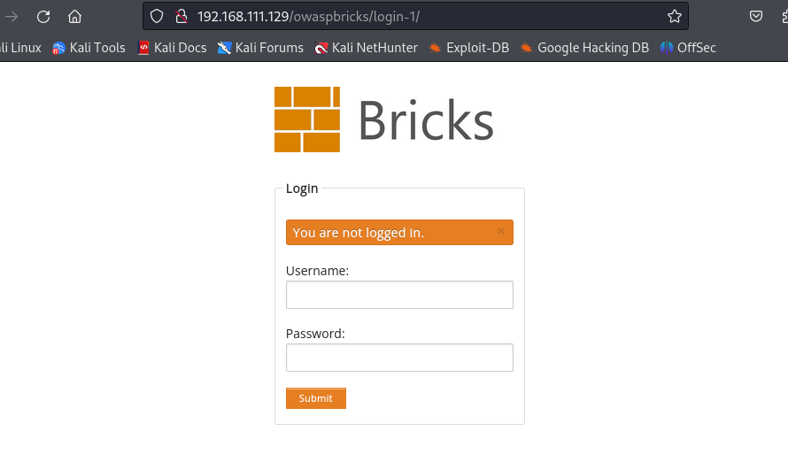
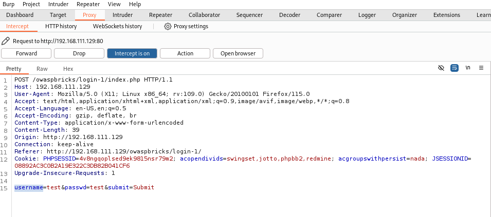
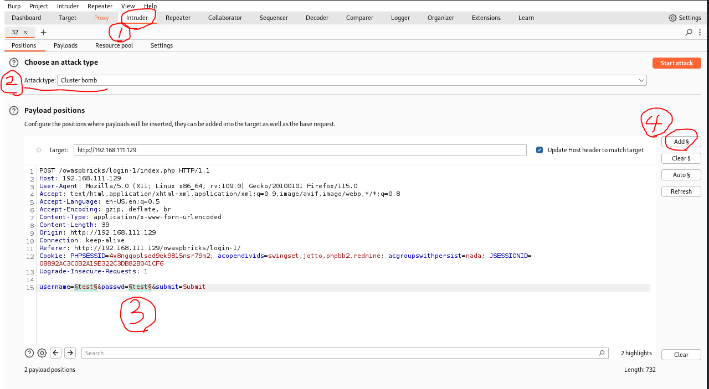
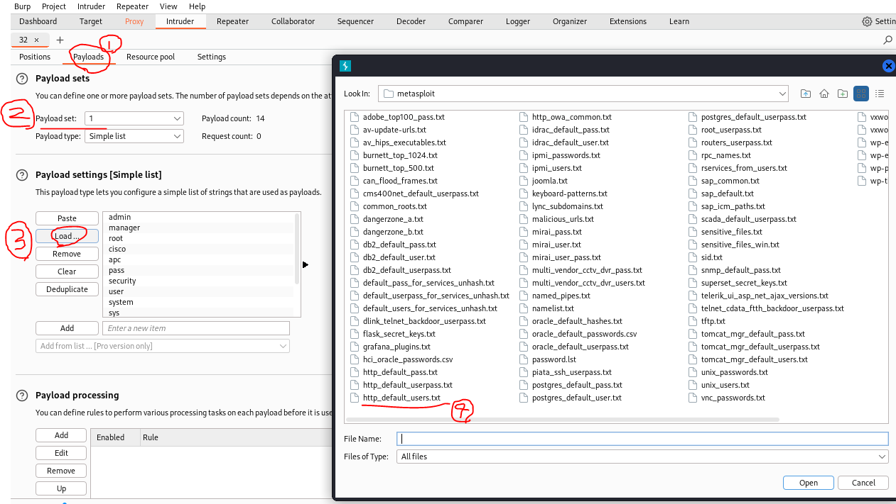
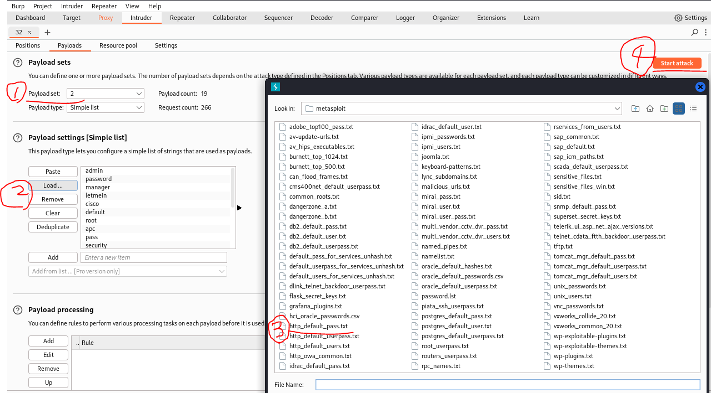
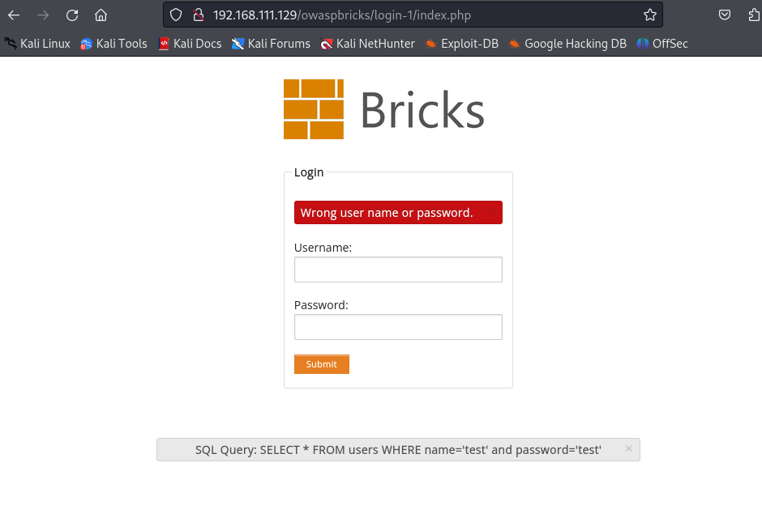
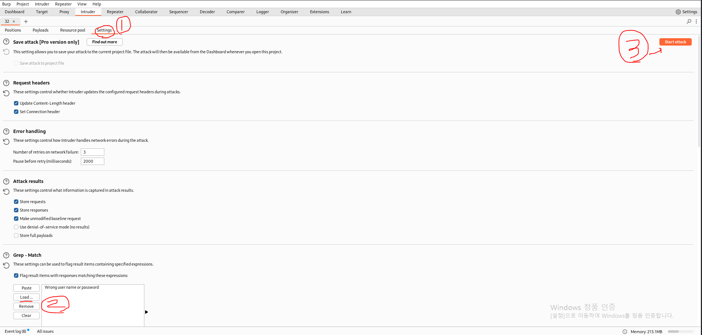
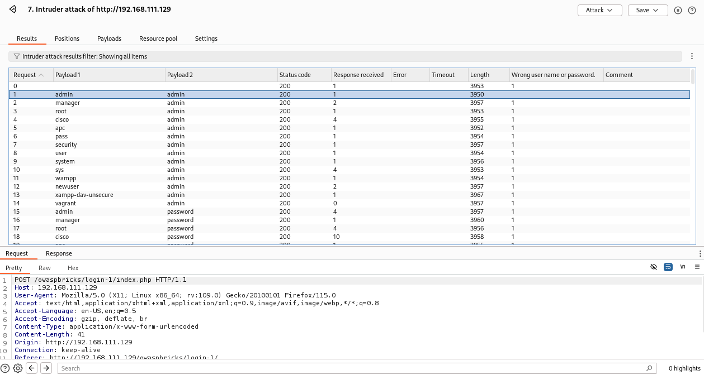
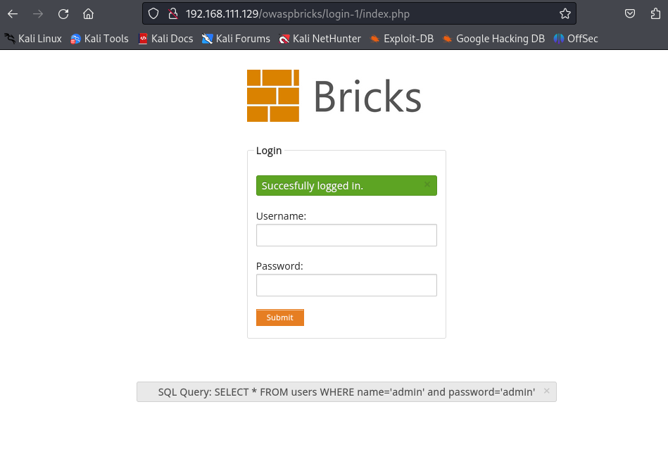

# Bruteforce Attacks

브루트포스 공격(bruteforce Attacks)이란, 무차별 대입 공격으로 조합 가능한 모든 문자열을 하나씩 대입해 보는 방식으로 암호를 해독하는 방법입니다.

주로 **Burpsuite의 Intruder** 또는 **Hydra** 툴을 이용하여 공격을 수행합니다.

# Bruteforce Attacks 예제

## 1. Burpsuite의 Intruder(Cluster Bomb)

다음은 Burpsuite Intruder의 **Cluster Bomb**을 사용하여 브루트포스 공격을하는 예제입니다.

**Cluster Bomb**: 모든 페이로드 리스트의 <b>모든 조합을 각 포지션에 대입</b>합니다. 예를 들어 두 위치가 있을 때 페이로드 A와 B의 모든 조합을 시도하는 방식입니다. 조합 가능한 모든 경우의 수를 테스트해야 할 때 유용하지만, 테스트 수가 기하급수적으로 늘어날 수 있습니다.

실습 URL: `http://192.168.111.129/owaspbricks/login-1/`

  

- Burpsuite의 'Intercept'를 `On`으로 변경합니다.

- Username과 Password에 각각 `test`를 입력합니다.

- Burpsuite을 보면 다음과 같은 정보가 출력됩니다.

  

- 일전에 학습한 Burpsuite Intruder의 Sniper와는 다르게 입력해야 하는 정보가 두 개입니다.

- 이 때, **Cluster Bomb**을 이용하여 두 개의 값에 모든 조합을 입력하여야 합니다.

- username의 `test`를 드래그하여 `Ctrl + I` 또는 마우스 우클릭의 `Send to Intruder`를 눌러줍니다.

- 그리고, `Intruder` 탭에서 'Attack type'을 Cluster Bomb으로 변경 후에 password의 `test`도 Intruder에 추가(Add) 해줍니다.

  

- 이제 Intruder 탭의 Payloads에서 입력할 값을 셋팅해야 합니다. Intruder할 *payload*가 두 개이므로 설정 가능한 `payload set`은 두 개입니다.

- `/usr/share/wordlists/metasploits`는 'wordlists'가 위치한 경로로, 패스워드 크래킹을 위한 단어 목록을 제공합니다. 해당 경로에서 주로 사용되는 아이디와 패스워드 단어 목록을 추가할 수 있습니다.

- `payload set`을 1로 설정한 후에 Username 목록을 제공하는 `http_default_users.txt`을 `Load`합니다.

  

- 위와 마찬가지로 `payload set`을 2로 설정한 후에 Password 목록을 제공하는 `http_default_pass.txt`을 `Load`합니다. 그리고 `Start attack` 버튼을 클릭하면 등록한 단어들을 조합하여 무차별 공격을 진행합니다. 

  

- 아래 그림과 같이, 'Payload1'과 'Payload2'에 각각 단어를 대입하여 공격을 진행하는데, `Length`가 거의 비슷하여, 어떤 단어가 일치하는지 알 수가 없습니다.

- Burpsuite의 'Intercept'를 종료(`Off`)하고, 브라우저를 보면 다음과 같은 정보가 나와 있습니다. 잘못된 정보를 입력하면 `Wrong user name or password.`를 출력하는 것을 알 수 있습니다.

  

- Intruder의 **Grep-Match** 기능은 HTTP 요청 및 응답 데이터를 분석할 때 특정 문자열이나 패턴을 자동으로 검색하고, 매칭된 값을 찾아주는 기능입니다. 즉, 여기에 `Wrong user name or password.`를 입력하면 올바르지 않은 로그인 정보에만 매칭되고, 올바른 로그인 정보에는 매칭되지 않을 것입니다.

- 아래 그림과 같이, Grep-Match `Wrong user name or password.`를 입력하고 다시 공격을 실행합니다.

  

- 아래 그림과 같이, Username과 Password가 `admin`인 Payload에만 `Wrong user name or password.`가 매칭되지 않은 것을 확인할 수 있습니다.

  

- 이제 웹브라우저에 Username과 Password에 `admin`을 입력하면 성공적으로 접속이 됩니다.

  

## 2. Hydra