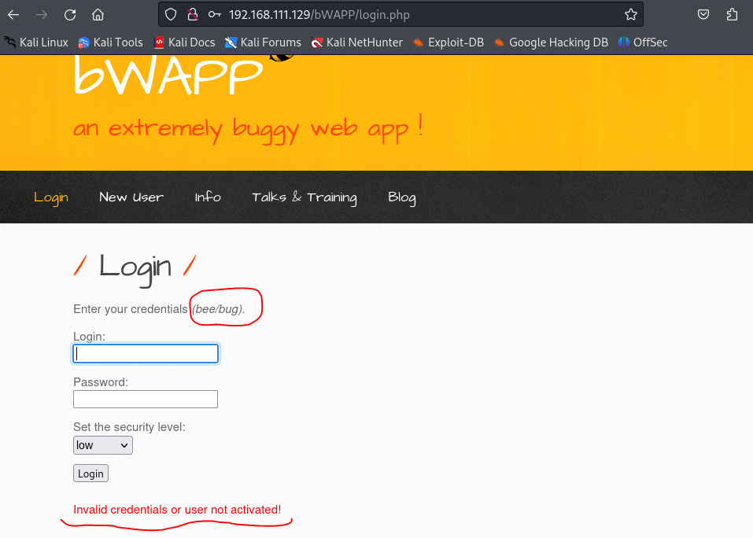
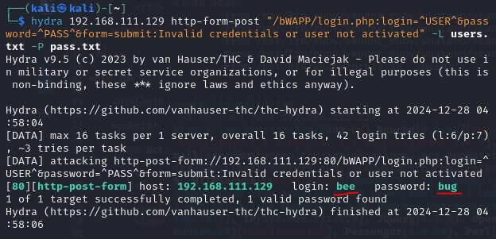

<hr>

# Bruteforce Attacks

브루트포스 공격(bruteforce Attacks)이란, 무차별 대입 공격으로 조합 가능한 모든 문자열을 하나씩 대입해 보는 방식으로 암호를 해독하는 방법입니다.

주로 **Burpsuite의 Intruder** 또는 **Hydra** 툴을 이용하여 공격을 수행합니다.

# Bruteforce Attacks 예제

## 1. Burpsuite의 Intruder(Cluster Bomb)

다음은 Burpsuite Intruder의 **Cluster Bomb**을 사용하여 브루트포스 공격을하는 예제입니다.

**Cluster Bomb**: 모든 페이로드 리스트의 <b>모든 조합을 각 포지션에 대입</b>합니다. 예를 들어 두 위치가 있을 때 페이로드 A와 B의 모든 조합을 시도하는 방식입니다. 조합 가능한 모든 경우의 수를 테스트해야 할 때 유용하지만, 테스트 수가 기하급수적으로 늘어날 수 있습니다.

실습 URL: `http://192.168.111.129/owaspbricks/login-1/`

<p id="img_center">
  
</p>

- Burpsuite의 'Intercept'를 `On`으로 변경합니다.

- Username과 Password에 각각 `test`를 입력합니다.

- Burpsuite을 보면 다음과 같은 정보가 출력됩니다.

<p id="img_center">
  
</p>

- 일전에 학습한 Burpsuite Intruder의 Sniper와는 다르게 입력해야 하는 정보가 두 개입니다.

- 이 때, **Cluster Bomb**을 이용하여 두 개의 값에 모든 조합을 입력하여야 합니다.

- username의 `test`를 드래그하여 `Ctrl + I` 또는 마우스 우클릭의 `Send to Intruder`를 눌러줍니다.

- 그리고, `Intruder` 탭에서 'Attack type'을 Cluster Bomb으로 변경 후에 password의 `test`도 Intruder에 추가(Add) 해줍니다.

<p id="img_center">
  
</p>

- 이제 Intruder 탭의 Payloads에서 입력할 값을 셋팅해야 합니다. Intruder할 *payload*가 두 개이므로 설정 가능한 `payload set`은 두 개입니다.

- `/usr/share/wordlists/metasploits`는 'wordlists'가 위치한 경로로, 패스워드 크래킹을 위한 단어 목록을 제공합니다. 해당 경로에서 주로 사용되는 아이디와 패스워드 단어 목록을 추가할 수 있습니다.

- `payload set`을 1로 설정한 후에 Username 목록을 제공하는 `http_default_users.txt`을 `Load`합니다.

<p id="img_center">
  
</p>

- 위와 마찬가지로 `payload set`을 2로 설정한 후에 Password 목록을 제공하는 `http_default_pass.txt`을 `Load`합니다. 그리고 `Start attack` 버튼을 클릭하면 등록한 단어들을 조합하여 무차별 공격을 진행합니다. 

<p id="img_center">
  
</p>

- 아래 그림과 같이, 'Payload1'과 'Payload2'에 각각 단어를 대입하여 공격을 진행하는데, `Length`가 거의 비슷하여, 어떤 단어가 일치하는지 알 수가 없습니다.

- Burpsuite의 'Intercept'를 종료(`Off`)하고, 브라우저를 보면 다음과 같은 정보가 나와 있습니다. 잘못된 정보를 입력하면 `Wrong user name or password.`를 출력하는 것을 알 수 있습니다.

<p id="img_center">
  
</p>

- Intruder의 **Grep-Match** 기능은 HTTP 요청 및 응답 데이터를 분석할 때 특정 문자열이나 패턴을 자동으로 검색하고, 매칭된 값을 찾아주는 기능입니다. 즉, 여기에 `Wrong user name or password.`를 입력하면 올바르지 않은 로그인 정보에만 매칭되고, 올바른 로그인 정보에는 매칭되지 않을 것입니다.

- 아래 그림과 같이, Grep-Match `Wrong user name or password.`를 입력하고 다시 공격을 실행합니다.

<p id="img_center">
  
</p>

- 아래 그림과 같이, Username과 Password가 `admin`인 Payload에만 `Wrong user name or password.`가 매칭되지 않은 것을 확인할 수 있습니다.

<p id="img_center">
  
</p>

- 이제 웹브라우저에 Username과 Password에 `admin`을 입력하면 성공적으로 접속이 됩니다.

<p id="img_center">
  
</p>

## 2. Hydra 브루트포스 공격

다음은 **Hydra** 툴을 이용한 브루트포스 공격 예제입니다.

실습 URL: `http://192.168.111.129/bWAPP/login.php`

- 아래 그림과 같이 로그인 페이지가 나타나며, 아이디는 `bee`, 패스워드는 `bug`라고 설명되어 있습니다. 추가로, 잘못된 정보를 입력하고 로그인 버튼을 누르면 `Invalid credentials or user not activated`라고 나오는 것도 확인할 수 있습니다.

<p id="img_center">
  
</p>

- Hydra로 브루트포스 공격을하기 위해서는 해당 페이지의 HTML 정보를 확인해야 합니다. 다음은 해당 페이지의 HTML에 있는 form 태그의 정보입니다.

```html
<form action="/bWAPP/login.php" method="POST">

  <p><label for="login">Login:</label><br />
  <input type="text" id="login" name="login" size="20" autocomplete="off"></p> 

  <p><label for="password">Password:</label><br />
  <input type="password" id="password" name="password" size="20" autocomplete="off"></p>

  <p><label for="security_level">Set the security level:</label><br />

  <select name="security_level">

      <option value="0">low</option>
      <option value="1">medium</option>
      <option value="2">high</option>

  </select>

  </p>  

  <button type="submit" name="form" value="submit">Login</button>  

</form>
```

- 위의 HTML 정보에서 중요한 사항은 다음과 같습니다.

  - *form* 태그의 `action="/bWAPP/login.php"`과 `method="POST"`
  - 로그인 *label*의 `name="login"`
  - 패스워드 *label*의 `name="password"`
  - 버튼의 `name="form"`과 `value="submit"`
  - 추가로 로그인 실패 시 출력되는 `Invalid credentials or user not activated`

<br>

- 실습을 위해 `users.txt` 파일을 만들고 다음과 같이 입력합니다.(아이디에 `bee`가 포함되도록)

```
user1
test
test123
root
bee
admin
```

- 마찬가지로 `pass.txt` 파일을 만들고 다음과 같이 입력합니다.(패스워드에 `bug`가 포함되도록)

```
password
bug
pass123
admin
vervose
induce
seduce
```

<br>

- 이제 위의 정보를 이용하여 Hydra로 브루트포스 공격을 진행하겠습니다. Hydra는 *CLI* 기반 툴이므로 터미널을 열고 다음과 같이 입력합니다. 

```bash
hydra 192.168.111.129 http-form-post "/bWAPP/login.php:login=^USER^&password=^PASS^&form=submit:Invalid credentials or user not activated" -L users.txt -P pass.txt
```

<br>

- 다음은 이 명령어에 대한 설명입니다.

  - `192.168.111.129`
    - 공격 대상의 IP 주소입니다. 이 경우, 브루트포스 공격을 수행할 서버가 `192.168.111.129`에 위치하고 있습니다.

  - `http-form-post`
    - 공격할 인증 방식으로, 이 경우 HTTP POST 요청을 통해 로그인 시도를 수행합니다.
    - 웹 로그인 폼에서 브루트포스를 실행할 때 사용됩니다.

  - `/bWAPP/login.php`
    - 공격 대상 웹 애플리케이션의 로그인 URL 경로입니다.
    - 여기서는 bWAPP(취약점 학습을 위한 웹 애플리케이션)의 `login.php` 페이지가 타겟입니다.

  - `login=^USER^&password=^PASS^&form=submit`
    - POST 요청에 전송될 폼 데이터입니다.
    - `^USER^`: `-L` 옵션에서 제공된 사용자 이름 파일에서 사용자 이름을 대체합니다.
    - `^PASS^`: `-P` 옵션에서 제공된 비밀번호 파일에서 비밀번호를 대체합니다.
    - `form=submit`: 폼의 전송 데이터입니다(HTML `<form>`의 버튼 이름이나 추가 필드).

  - `Invalid credentials or user not activated`
    - Hydra는 이 문자열을 응답에서 찾아 성공 여부를 판단합니다.
    - 이 문구가 응답에 포함되면 인증이 실패한 것으로 간주합니다.
    - 실패 문자열은 대상 애플리케이션의 응답에서 수동으로 확인해야 합니다.

  - `-L users.txt`
    - 공격에 사용할 사용자 이름 목록 파일입니다.
    - 예: `admin`, `user1`, `test` 등이 포함된 텍스트 파일.

  - `-P pass.txt`
    - 공격에 사용할 비밀번호 목록 파일입니다.
    - 예: `password`, `123456`, `letmein` 등이 포함된 텍스트 파일.

<br>

- 입력을 완료하고, 엔터를 누르면 다음과 같이 아이디 `bee`와 패스워드 `bug`가 성공적으로 출력되는 것을 볼 수 있습니다. 다음은 Hydra의 주요 작동 방식입니다.

  - Hydra는 `users.txt`와 `pass.txt`에 포함된 모든 사용자 이름과 비밀번호 조합으로 `http-form-post` 요청을 반복적으로 전송합니다.

  - 각 요청 후, 서버의 응답을 검사하여 `Invalid credentials or user not activated` 문구가 포함되어 있는지 확인합니다.

    - 이 문구가 포함되어 있으면 해당 조합은 실패한 것으로 간주.

    - 포함되지 않으면 성공으로 간주하고 결과를 출력합니다.

  - 성공적인 로그인 조합을 발견하면 이를 기록하고 공격을 종료(기본 설정)합니다.

<p id="img_center">
  
</p>